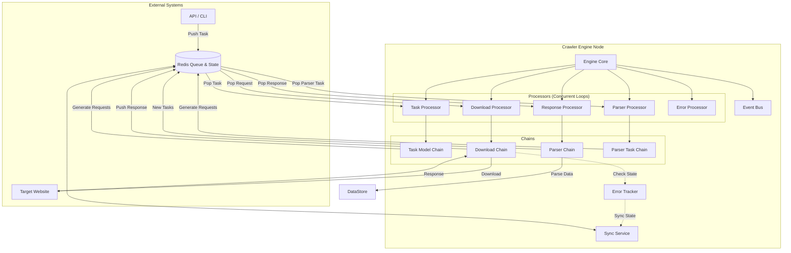
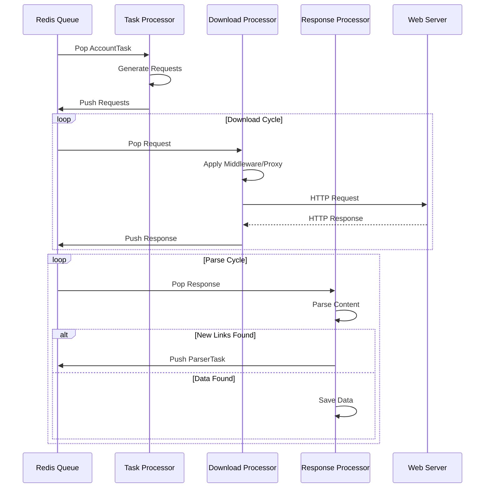

# Crawler Engine (爬虫引擎)

Crawler Engine 是一个高性能、分布式、模块化的爬虫引擎，基于 Rust 语言开发。它采用了事件驱动架构和责任链模式，支持大规模并发抓取、分布式部署、动态代理、JavaScript 执行环境（V8）以及灵活的中间件扩展。

## 核心特性

*   **高性能与并发**: 基于 Tokio 异步运行时，充分利用系统资源进行高并发抓取。
*   **分布式架构**: 使用 Redis 作为消息队列和状态同步服务，支持多节点部署，自动负载均衡。
*   **模块化设计**: 爬虫逻辑封装在独立的 Module 中，支持动态加载和热插拔。
*   **责任链模式 (Chain of Responsibility)**: 核心流程（任务生成、下载、解析）均通过 Processor Chain 组织，易于扩展和维护。
*   **多层级错误追踪 (Error Tracker)**: 支持 Task、Module、Request 三个层级的错误统计与熔断机制，自动处理重试和故障隔离。
*   **中间件系统**: 支持 Request、Response、Data、Store 等多种类型的中间件，灵活定制抓取流程。
*   **JS 运行时支持**: 内置 V8 引擎，支持执行 JavaScript 代码，应对复杂的动态网页或加密逻辑。
*   **完善的监控**: 内置事件总线 (Event Bus)，支持日志、指标监控，并可对接 Redis 进行实时监控。

## 系统架构

Crawler Engine 采用微内核架构，核心组件通过消息队列解耦。



## 数据流转

数据在系统中的流转遵循以下路径：

1.  **任务生成 (Task Generation)**:
    *   外部系统提交 `AccountTask` 到队列。
    *   `TaskProcessor` 获取任务，通过 `TaskModelChain` 处理。
    *   加载对应的 `Module`，生成初始 `Request` 列表。
    *   `Request` 被推送到 Request Queue。

2.  **下载流程 (Downloading)**:
    *   `DownloadProcessor` 从队列获取 `Request`。
    *   进入 `DownloadChain`:
        *   **Config**: 加载下载配置。
        *   **Proxy**: 获取并设置代理 IP。
        *   **Request Middleware**: 执行请求中间件（如添加 Headers、签名）。
        *   **Downloader**: 执行实际的网络请求。
        *   **Response Middleware**: 执行响应中间件（如解压、编码转换）。
        *   **Publish**: 将 `Response` 推送到 Response Queue。
    *   *错误处理*: 如果下载失败，根据 `ErrorTracker` 策略进行重试或熔断。

3.  **解析流程 (Parsing)**:
    *   `ResponseProcessor` 从队列获取 `Response`。
    *   进入 `ParserChain`:
        *   调用对应的解析逻辑提取数据。
        *   如果发现新链接或下一页，生成 `ParserTask` 推送到队列。
        *   提取的数据通过 `DataMiddleware` 和 `StoreMiddleware` 处理。

4.  **循环迭代**:
    *   `ParserProcessor` 处理 `ParserTask`，生成新的 `Request`，形成抓取循环。



## 核心模块说明

### 1. Kernel (`kernel/`)
系统的核心库，定义了基础数据模型和核心服务。
*   **Task**: 任务定义与管理。
*   **Model**: `Request`, `Response`, `Context` 等基础数据结构。
*   **Sync**: 基于 Redis 的分布式锁和状态同步服务。
*   **ErrorTracker**: 负责错误计数、健康度评分和熔断决策。

### 2. Engine (`engine/`)
负责系统的启动、调度和生命周期管理。
*   **Core**: 定义了 `Engine` 结构体，负责启动各个 Processor。
*   **Events**: 事件系统，处理系统内部的各种事件（如下载开始、失败、完成）。
*   **Chain**: 组装各个 Processor Chain。

### 3. Downloader (`downloader/`)
负责网络请求的发送。
*   支持多种下载后端（如 Reqwest）。
*   处理 TLS、超时、重定向等底层网络细节。

### 4. Processor Chain (`processor_chain/`)
通用的责任链实现。
*   定义了 `ProcessorTrait` 和 `Chain` 结构。
*   支持异步处理、错误捕获和上下文传递。

### 5. JS V8 (`js-v8/`)
集成了 V8 引擎。
*   允许在 Rust 中执行 JavaScript 代码。
*   常用于解密参数、生成动态 Token 等场景。

## 快速开始

### 环境要求
*   Rust (最新稳定版)
*   Redis (用于队列和状态同步)
*   Kafka (可选，用于消息总线)

### 配置
在 `Cargo.toml` 同级目录下创建配置文件（通常是 `config.toml` 或通过环境变量配置），配置 Redis 连接地址等信息。

### 运行
```bash
# 运行引擎
cargo run --package engine
```

## 错误处理机制

系统内置了强大的 `ErrorTracker`，支持三级错误控制：

1.  **Request 级别**: 控制单个请求的重试次数（默认 3 次）。
    *   *策略*: 失败后指数退避重试，成功后减少错误计数。
2.  **Module 级别**: 控制单个模块的错误容忍度。
    *   *策略*: 错误超过阈值（如 10 次），熔断该 Module，释放资源。
3.  **Task 级别**: 控制整个任务的健康度。
    *   *策略*: 错误过多导致整个 Task 终止。

## 开发指南

### 添加新的中间件
实现 `MiddlewareTrait` 并在 `MiddlewareManager` 中注册。

```rust
pub struct MyCustomMiddleware;

#[async_trait]
impl MiddlewareTrait for MyCustomMiddleware {
    async fn handle_request(&self, req: Request) -> Request {
        // 修改请求
        req
    }
}
```

### 添加新的解析模块
实现 `ModuleTrait`，定义如何生成请求和解析响应。

---
*Copyright © 2025 Crawler Engine Team.*
